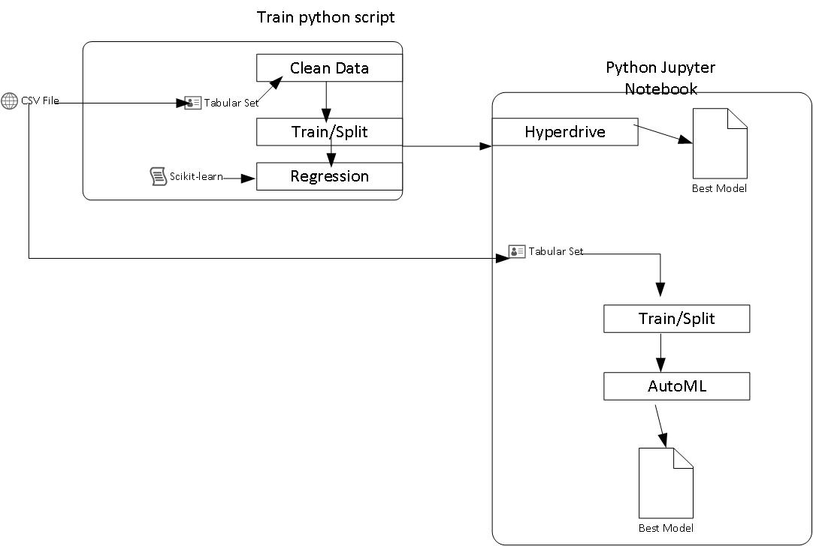

# Machine Learning Pipeline: Optimization using the Azure platform

## Overview
This project compares two pipeline optimizations.  The first one uses Hyperdrive (a python package that automates picking the best hyperparameters for your model) and a Scikit-learn model (regression).  The second one uses Azure and AutoML.  The models are compared for accuracy. 

## The Model Data
The data has customer observations (32,950) from a direct marketing campaign of a Portuguese banking institution. 

1. age (numeric)
1. job : type of job (categorical: 'admin.','blue-collar','entrepreneur','housemaid','management','retired','self-employed','services','student','technician','unemployed','unknown')
1. marital : marital status (categorical: 'divorced','married','single','unknown'; note: 'divorced' means divorced or widowed)
1. education (categorical: 'basic.4y','basic.6y','basic.9y','high.school','illiterate','professional.course','university.degree','unknown')
1. default: has credit in default? (categorical: 'no','yes','unknown')
1. housing: has housing loan? (categorical: 'no','yes','unknown')
1. loan: has personal loan? (categorical: 'no','yes','unknown')
1. contact: contact communication type (categorical: 'cellular','telephone')
1. month: last contact month of year (categorical: 'jan', 'feb', 'mar', ..., 'nov', 'dec')
1. day_of_week: last contact day of the week (categorical: 'mon','tue','wed','thu','fri')
1. duration: last contact duration, in seconds (numeric). 
1. campaign: number of contacts performed during this campaign and for this client (numeric, includes last contact)
1. pdays: number of days that passed by after the client was last contacted from a previous campaign (numeric; 999 means client was not previously contacted)
1. previous: number of contacts performed before this campaign and for this client (numeric)
1. poutcome: outcome of the previous marketing campaign (categorical: 'failure','nonexistent','success')
1. emp.var.rate: employment variation rate - quarterly indicator (numeric)
1. cons.price.idx: consumer price index - monthly indicator (numeric)
1. cons.conf.idx: consumer confidence index - monthly indicator (numeric)
1. euribor3m: euribor 3 month rate - daily indicator (numeric)
1. nr.employed: number of employees - quarterly indicator (numeric)

**Output **
1. y - has the client subscribed a term deposit? (binary: 'yes','no')

**Solution**

Because we have to predict yes or no (0 or 1), a binary classification model is used here to determine if the client will subscribe to a term deposit. The `VotingEnsemble` model by the Azure AutoML run with an Accuracy of `0.91721` which was better than logistic regression model optimized by `Hyperdrive`.

## Scikit-learn Pipeline

When we ran the experiment we gave the following parameters:
ps = RandomParameterSampling({
    '--C': uniform(0.001, 1.0),
    '--max_iter': choice(0, 10, 50, 100, 150, 200)
})

When the model is run and the most accurate run is selected, here is the output:

['--C', '0.4725712603502653', '--max_iter', '200']

Thus the Regularization strength was 0.47 and the Number of iterations was 200 for the best run. 

### Logistic Regression + Hyperdrive Setup

1. A skeleton of the python `train.py` script which creates the Tabular dataset. This also contains data cleansing and the model setup for Scikit.

1. Also a skeleton of the Hyperdrive configuration settings which was fleshed out to call`train.py`.

1. The run was done on an Azure ML compute cluster. Data is imported in csv format, data is made tabular, cleansed, and split.

1. The hyperparameters are configured and the data is fed to the Scikit-learn Logistic Regression model.  

1. Different combination of hyperameter values are used to train the model. Using the test data, the Hyperdrive creates Regression models and the accuracy are logged.

1. The model with the highest accuracy is then saved.

### AutoML Configuration
1. The AutoML run is set up with a Tabular Dataset and is imported in csv format, data is made tabular, cleansed, and split.

1. The training configuration is set to `classification` and the label (dependent variable) specified.

1. The kfold `n_cross_validation` value is set, and `primary_metric` is set as `accuracy`.

1. Then run teh AutoML.

1. AutoML picks different hyperparameters and algorithms. 

1. The most accurate model from AutoML run is obtained.

**Benefits?**

Random Parameter Sampling was chosen as the Hyperparameter tuning algorithm. The benefit of this search algorithm is that it provides a good model by randomly selecting hyperparameter values from a defined search space. This makes it less computational intensive and much faster. It also supports early stoping policy.

**What are the benefits of the early stopping policy?**

If a run is performing badly it stops and no compute time is wasted. This flow use the Bandit policy which stops a run if it underperforms the best run by a defined value called "Slack". The "Bandit policy" was chosen because top performance runs are kept until the end. This run used the following arguments evaluation_interval=3, slack_factor=0.1, delay_evaluation=3 - if the best AUC reported for a run is Y, then the value (Y + Y * 0.1) to 0.9, and if smaller, cancels the run. If delay_evaluation = 3, then the first time the policy will be applied is at interval 3, so it gets aplied early on. 

## AutoML

AutoML generates different models and hyperparameters automatically for all the different algorithms.  AutoML tries 17 different algorithms combined with scaling and normalization and ensemble methods.  The run defines how long to try for and then the best model is chosen. Note that this run is set to timeout after 30 minutes. 

## Pipeline Differences

The best model  was `VotingEnsemble` using AutoML (accuracy .9166). It was slightly better than `Logistic Regression + Hyperdrive` model (accuracy .9144).  
The AutoML took much longer to execute. Voting Ensemble is an ensemble algorithm which combines multiple models to achieve higher performance than the single models individually and uses the weighted average of predicted class probabilities. 

## Future work

As we did in class, the hyperdrive hyperparameter search algorithms(GridParameterSampling or BayesianParameterSampling) could be varied to see if the performance improves. I also think working iwth Deep Neural Networks (DNNs), and Deep Learning could improve performance. 

## Cluster clean up
See `aml_compute.delete()` in the code
